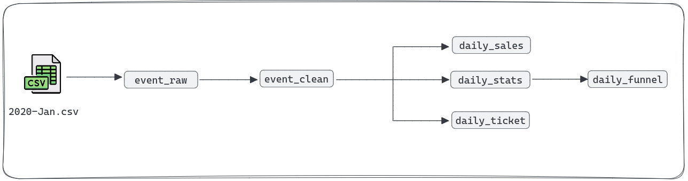

# Solution of the [Analytics Engineering Assignment](https://github.com/viodotcom/analytics-engineer-assignment) from Vio

## Task 1: Ingesting the data

The approach to solving the first task - data ingestion - involved creating an `event_raw` table with the given schema and using the SQLite `.import` command. 

Since SQLite version `3.31.1` does not have an argument to remove the file header for the .import command (introduced in version `3.32.0`), the solution was to use a UNIX CLI command `| tail -n +2` to remove the header while ingesting the data.

Additionally, all columns in the table were created with the `TEXT` datatype. It is good practice to keep the schema of the ingestion layer in your data warehouse as textual—unless there is a compelling reason to maintain the same datatype as the source system, such as a partitioning column—to avoid issues with your data pipeline if the expected behavior of your source system changes. If there are any changes over time, it is also easier to maintain the data pipeline if the data is already in your data warehouse.

## Task 2: Cleaning up the data

Before cleaning the data, some assumptions were made about the behaviour of each field to generate the `event_clean` table. 

The table below lists every checked assertion and the type of the issue. An **error** is a row that will not be inserted in `event_clean` because it may indicate some malfunction of the source system (like a missing `event_time` records) and/or break the transformations used `event_clean` (like a non-numeric `user_id`); a **warning** is a row that may indicate some problem, but was treated because it seems to be an expected change in the behavior of the source system (like a different `event_type` record) or we may, probably, find the same information in other tables (like the `brand` record from our product).

Ideally, we should monitor both types of assertions to keep track of the data quality in our data pipeline.

|PERIOD  | COLUMN      | ASSERTION                        |  TYPE             | # OCCURENCES |
| -------|---------    |-----------                       |-----------        |------        |
|2020-01 |price        |price_with_negative_values        |error              |39            |
|2020-01 |event_time   |NULL_or_empty_values              |error              |0             |
|2020-01 |product_id   |product_id_non_numeric_values     |error              |0             |
|2020-01 |category_id  |category_id_non_numeric_values    |error              |0             |
|2020-01 |user_id      |user_id_with_non_numerical_values |error              |0             |
|2020-01 |user_id      |NULL_or_empty_values              |error              |0             |
|2020-02 |price        |price_with_negative_values        |error              |37            |
|2020-02 |event_time   |NULL_or_empty_values              |error              |0             |
|2020-02 |product_id   |product_id_non_numeric_values     |error              |0             |
|2020-02 |category_id  |category_id_non_numeric_values    |error              |0             |
|2020-02 |user_id      |user_id_with_non_numerical_values |error              |0             |
|2020-02 |user_id      |NULL_or_empty_values              |error              |0             |
|                                                                                            |
|2020-01 |category_code|NULL_or_empty_values              |warning            |4,190,033     |
|2020-01 |brand        |NULL_or_empty_values              |warning            |1,775,630     |
|2020-01 |user_session |NULL_or_empty_values              |warning            |1,314         |
|2020-01 |event_time   |outside_file_period               |warning            |0             |
|2020-01 |event_type   |NULL_or_empty_values              |warning            |0             |
|2020-01 |event_type   |event_type_outside_expected_values|warning            |0             |
|2020-01 |product_id   |NULL_or_empty_values              |warning            |0             |
|2020-01 |category_id  |NULL_or_empty_values              |warning            |0             |
|2020-01 |price        |NULL_or_empty_values              |warning            |0             |
|2020-01 |price        |price_with_non_numerical_values   |warning            |0             |
|2020-02 |category_code|NULL_or_empty_values              |warning            |4,079,497     |
|2020-02 |brand        |NULL_or_empty_values              |warning            |1,825,908     |
|2020-02 |user_session |NULL_or_empty_values              |warning            |1,055         |
|2020-02 |event_time   |outside_file_period               |warning            |0             |
|2020-02 |event_type   |NULL_or_empty_values              |warning            |0             |
|2020-02 |event_type   |event_type_outside_expected_values|warning            |0             |
|2020-02 |product_id   |NULL_or_empty_values              |warning            |0             |
|2020-02 |category_id  |NULL_or_empty_values              |warning            |0             |
|2020-02 |price        |NULL_or_empty_values              |warning            |0             |
|2020-02 |price        |price_with_non_numerical_values   |warning            |0             |

The above data  was extracted through the `sql/099-clean-data-analysis.sql` file query.

As for each field, the data type and transformation were determined based on the table below:

|COLUMN         | TRANSFORMATION                                        |
|-------        |--------------                                         |
| event_time    |  Removed `UTC` from the record                        |
|               |  Casted as `DATETIME`                                 |
| event_type    |  Possible missing values were replaced with `"None"`  |
| product_id    |  Possible missing values were replace with `0`        |
|               |  Casted as `INTEGER`                                  | 
| category_id   |  Possible missing values were replace with `0`        |
|               |  Casted as `INTEGER`                                  | 
| category_code |  Possible missing values were replaced with `"None"`  |
| brand         |  Possible missing values were replaced with `"None"`  |
| price         |  Casted as `REAL`                                     | 
| user_id       |  Casted as `INTEGER`                                  |  
| user_session  |  Possible missing values were replaced with `"None"`  | 

## Task 3: Daily sales

For the `daily_sales` table, the solution was to aggregate the `event_clean` data through the transformation from `event_time` to `date` and the **sum(()), for each day, of the `price` column.

## Task 4: Daily stats of visitors, sessions, viewers, views, leaders, leads, purchasers and purchases

For the `daily_stats` table, the solution was also the aggregation for `event_clean` data through the transformation from `event_time` to `date`, counting both the occurrences of each event (`event_type = ${EVENT}`) and **distinct** users (`user_id`) for each event.

## Task 5: Daily conversion funnel

For the `daily_funnel` table, the solution was, based on the data already made available in `daily_stats` table, the ratio between each step of the funnel.

In this task, it is crucial to emphasise the importance of maintaining high data quality in our pipeline. If the expected `event_type` for any funnel step changes, we need to update our `data_stats` table to prevent potential issues such as attempting to divide a conversion step by zero, which could break the pipeline

Also, we have to cast at least one column as real `REAL` while dividing them so SQLite returns a `REAL` data type number.

## Task 6: Daily ticket size

The primary challenge in dealing with the `daily_ticket` table was to determine the most straightforward method for solving the percentile issue. SQLite has fewer statistical tools than other analytical data warehouses, such as BigQuery, Redshift, and Snowflake. Furthermore, a percentile is [defined](https://www.britannica.com/topic/percentile) in the Britannica Encyclopedia as:

> Percentile, a number denoting the position of a data point within a numeric dataset by indicating the percentage of the dataset with a lesser value.

So, if we want to calculate the 25th, 50th and 75th percentiles, the `sql/060-daily-ticket` was created following the algorithm below:
1. Calculate the `user_session_ticket_value`  (the total `price` for a `user_session` and `date`);
2. Count the number of `tickets` for each `date` (`daily_total_user_session_count`);
3. Order (`ROW_NUMBER`) all tickets based on their `user_session_ticket_value`;
4. Get the expected number of records for each day below the 25th, 50th and 75th percentiles (`(k_percentile/100) * daily_total_user_session_count = k_perc_rn`);
5. Finally, look up the ordered tickets exactly the `k_perc_rn` for each day and its `user_session_ticket_value`.

After this task, we have the generated lineage below:

## Task 7: Incremental load

In the final task, all queries were adjusted to use incremental logic for each load. The approach was to develop an agnostic solution, importing all *.csv files into a **temporary table** in `sql/010-import-data.sql` (`'.import | tail -n +2 -q data/*.csv'`) and then ingesting only the data relevant to the new period into `event_raw`.

If the database state is maintained, and a CSV file for a March 2020 event is placed in the `data/` folder, only the new period from the temporary table will be loaded into the database. This new period will be programmatically calculated by selecting the most recent `event_time` in the `event_raw` table. The same approach was also used to load data into the `event_clean` table.

Since all the assigned tables have a temporal reference (aggregating data based on `date`), the simplest solution was to process and insert the new data according to what was already present in each table, just as it was done with the `event_raw` and `event_clean` tables.

This solution was created with a focus on completing the assigned request,but it may only be effective in specific scenarios.
1. **Low volume of data**: Since we are importing each file into a temporary table in the database, having many files in the `data/` folder means that we will be importing a significant amount of data that we won't use.

2. **100% consistent event_time**: If a new file has a single record with a timestamp like `2099-12-31 00:00:00`, all new batch loads will not load anything. As we are importing CSVs, we may have some human intervention that makes this situation not so unlikely.

3. **Never reprocessing data**: If some delayed events show up in a new `2020-Jan_v2.csv` file, we will be unable to import this data or even recreate the downstream tables with the new data. This situation is likely to happen in a real-life scenario.

What changes can we make to this data pipeline to ensure greater consistency? The diagram below shows a suggested architecture with the same tools already used in this assignment:

1. Call `010-import-data.sql` script to ingest the files from a  `new/` folder (our "landing area");
2. Import all files data into `event_raw` table. In this scenario, the `event_raw` table must be an **insert only** table. It is important that we alter our `event_raw` table and add two new columns: `reference_period` and `imported_at`;
3. Call both `020-clean-data.sql` to generate `event_clean` table and a `move-processed-files.sh` bash script´
4. The bash script will move the files from `new/` folder to `processed/` folder; 
5. Import, into `event_clean` table, only the **most recent events** for each month. In this scenario, we will do a **full load** of the most recent event based on the `reference_period` and `imported_at` column. In this scenario, we will assure that only the most recent version of each period will be used downstream;
6. Execute all `030-daily-sales.sql`, `040-daily-stats.sql` and `060-daily-ticket.sql` scripts. We can parallelize the three tasks as there is no dependency on then;
7. Update `daily_sales`, `daily_stats` and `daily_ticket` tables; 
8. After finishing the update on `daily_stats` table, execute the `050-daily-funnel.sql` script, as `daily_stats` table is an upstream dependency to `daily_funnel` table;
9. Finally, update `daily_funnel` table.

Of course, since we are working with a SQLite database, this approach still has limitations regarding data volume. It is more advisable to execute this in more robust data warehouses. This approach addresses the lack of consistency when new data arrives or when we must update an already processed period. However, it also considerably increases the load on the downstream tables
